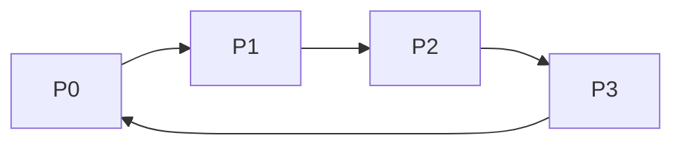

## 1. Deadlock

### 1-1. Deadlock이란?
**Deadlock: 프로세스가 각자 자원을 점유하면서, 다른 프로세스가 점유하고 있는 자원을 기다리는 상태.**  

> 도로 하나를 두고 두 자동차가 대립하는 상황으로 비유할 수 있다.
{: .prompt-info }

### 1-2. Deadlock의 조건
아래 4개의 조건을 동시에 만족하면 deadlock의 가능성이 있다.  

1. **Mutual Exclusion**(상호 배타성): 자원 하나를 프로세스 하나만 쓸 수 있음.
2. **Hold and Wait**(점유하고 대기): 프로세스가 자원을 점유하면서 다른 프로세스의 자원을 요구해야 함.
3. **Non-preemption**(비선점형): 할당된 자원을 뺏어올 순 없고, 프로세스가 스스로 반납해야 함.
4. **Circular Wait**(순환대기): 프로세스들의 자원 요구 그래프가 사이클을 형성해야 함.

그럼 이제 deadlock을 다루는 법에 대해 알아보자.

---

## 2. Deadlock Prevention
deadlock의 4가지 조건 중 하나라도 만족하지 않을 시엔, deadlock이 발생하지 않는다. deadlock prevention은 deadlock 조건을 불만족시켜서 deadlock이 아예 발생하지 않도록 예방하는 방법이다. 그럼 어떻게 각 조건들을 불만족시킬 지 알아보자.

- **Mutual Exclusion**: 이 조건을 불만족시키려면 프로세스끼리 자원을 *공유*해서 써야한다. 이 방법은 다음의 이유로 추천되지 않는다.

> 두 프로세스가 프린터 하나를 공유한다고 치자. 한 프로세스는 `안녕`을 출력하고, 다른 프로세스는 `Hi`를 출력한다. 이렇게 되면 결과는 `안H녕i` `안Hi녕`처럼 이상하게 출력될 것이다.
{: .prompt-warning }

- **Hold and Wait**: 프로세스가 실행을 시작할 때에, 필요한 자원을 모두 요청하도록 만든다. 프로세스는 자신이 점유한 자원이 없을 때만 자원을 요구할 수 있다. 이 방법은 낮은 자원 효율성과 starvation을 야기한다.

- **Non-preemption**: 만약 자원을 점유한 프로세스가 현재 유효하지 않은 자원을 요구하면, 점유하던 모든 자원을 뺏는다. 해당 프로세스는 요구하던 자원과 빼앗긴 자원을 요구 리스트에 둘 다 추가한다. 나중에 두 자원 모두 할당받으면 프로세스를 다시 시작할 수 있다.

- **Circular Wait**: 자원에 순서를 부여하여, 프로세스가 점유한 자원 순서가 요구한 자원의 순서보다 낮을 시에만 자원을 할당받게 만든다.

> *tape drive < disk drive < printer* 순으로 자원 순서가 정해져 있다면,  
*tape drive*를 점유하고 *disk drive*를 요구하는건 괜찮지만, *disk drive*를 점유하고 *tape drive*를 요구하는건 안 된다. 이 방법을 쓰면 *printer*를 점유한 프로세스가 *tape drive*를 요구하지 못하게 되어, 사이클이 발생하지 않는다.
{: .prompt-info }

---

## 3. Deadlock Avoidance
이 방법은 deadlock을 원천차단하는 대신, 피해 다니는 방법이다. 자원을 할당하기 전에 시스템이 deadlock에 빠지게 되는지를 판단하여 자원 할당 여부를 결정한다.

### 3-1. Safe State

### 3-2. Resource Allocation Graph Algorithm

### 3-3. Banker's Algorithm

### 3-4. Safety Algorithm

### 3-5. Example

---

## 4. Deadlock Detection

### 4-1. Wait-for Graph

### 4-2. Detection Algorithm

---

## 5. Recovery from Deadlock

### 5-1. Process Termination

### 5-2. Resource Preemption