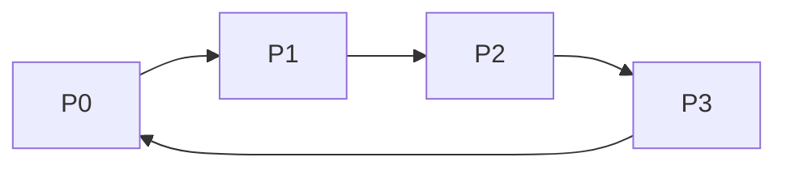
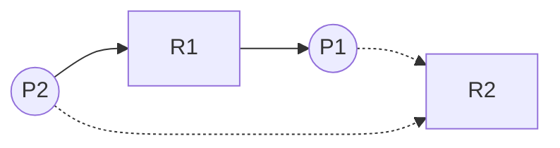
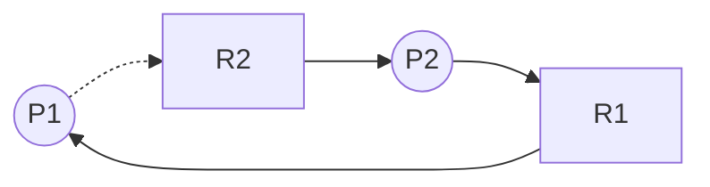

## 1. Deadlock

### 1-1. Deadlock이란?
**Deadlock: 프로세스가 각자 자원을 점유하면서, 다른 프로세스가 점유하고 있는 자원을 기다리는 상태.**  

> 도로 하나를 두고 두 자동차가 대립하는 상황으로 비유할 수 있다.
{: .prompt-info }

### 1-2. Deadlock의 조건
:round_pushpin: 아래 4개의 조건을 **동시에 만족하면 deadlock의 가능성이 있다.**  

1. **Mutual Exclusion**(상호 배타성): 자원 하나를 프로세스 하나만 쓸 수 있음.
2. **Hold and Wait**(점유하고 대기): 프로세스가 자원을 점유하면서 다른 프로세스의 자원을 요구해야 함.
3. **Non-preemption**(비선점형): 할당된 자원을 뺏어올 순 없고, 프로세스가 스스로 반납해야 함.
4. **Circular Wait**(순환대기): 프로세스들의 자원 요구 그래프가 사이클을 형성해야 함.

그럼 이제 deadlock을 다루는 법에 대해 알아보자.

---

## 2. Deadlock Prevention
:round_pushpin: deadlock의 4가지 조건 중 하나라도 만족하지 않을 시엔, deadlock이 발생하지 않는다.  
 
deadlock prevention은 deadlock 조건을 불만족시켜서 deadlock이 아예 발생하지 않도록 예방하는 방법이다. 그럼 어떻게 각 조건들을 불만족시킬 지 알아보자.

- **Mutual Exclusion**: 이 조건을 불만족시키려면 프로세스끼리 자원을 *공유*해서 써야한다. 이 방법은 다음의 이유로 추천되지 않는다.

> 두 프로세스가 프린터 하나를 공유한다고 치자. 한 프로세스는 `안녕`을 출력하고, 다른 프로세스는 `Hi`를 출력한다. 이렇게 되면 결과는 `안H녕i` `안Hi녕`처럼 이상하게 출력될 것이다.
{: .prompt-warning }

 

- **Hold and Wait**: 프로세스가 실행을 시작할 때에, 필요한 자원을 모두 요청하도록 만든다. 프로세스는 자신이 점유한 자원이 없을 때만 자원을 요구할 수 있다. 이 방법은 낮은 자원 효율성과 starvation을 야기한다.

 

- **Non-preemption**: 만약 자원을 점유한 프로세스가 현재 유효하지 않은 자원을 요구하면, 점유하던 모든 자원을 뺏는다. 해당 프로세스는 요구하던 자원과 빼앗긴 자원을 요구 리스트에 둘 다 추가한다. 나중에 두 자원 모두 할당받으면 프로세스를 다시 시작할 수 있다.

 

- **Circular Wait**: 자원에 순서를 부여하여, 프로세스가 점유한 자원 순서가 요구한 자원의 순서보다 낮을 시에만 자원을 할당받게 만든다.

> *tape drive < disk drive < printer* 순으로 자원 순서가 정해져 있다면,  
*tape drive*를 점유하고 *disk drive*를 요구하는건 괜찮지만, *disk drive*를 점유하고 *tape drive*를 요구하는건 안 된다. 이 방법을 쓰면 *printer*를 점유한 프로세스가 *tape drive*를 요구하지 못하게 되어, 사이클이 발생하지 않는다.
{: .prompt-info }

---

## 3. Deadlock Avoidance
이 방법은 deadlock을 원천차단하는 대신, 피해 다니는 방법이다. 자원을 할당하기 전에 시스템이 deadlock에 빠지게 되는지를 판단하여 자원 할당 여부를 결정한다.  
 
:memo: 시스템은 *프로세스의 총 자원 요구량 등과 관련된 추가적인 사전 정보*를 필요로 한다. 

### 3-1. Safe State
Safety Algorithm을 돌려 나온 결과에 safe sequence가 존재한다면, 시스템은 현재 Safe State에 머물러 있다. safe sequence에 대해 더 자세한건 3-4에서 다룰 예정이다.  
 
:memo: 프로세스가 자원을 요구하면, *시스템은 이 프로세스에게 할당해도 시스템이 safe state인지 판단해야 한다.*
- **safe state** = safe sequence 존재 = deadlock 없음
- **unsafe state** = safe sequence 없음 = deadlock 가능성 있음

### 3-2. Resource Allocation Graph Algorithm
:round_pushpin: 자원 종류에 따라 **각 자원 당 하나의 인스턴스만 존재할 때** 사용하는 알고리즘이다.  
 
프로세스가 자원을 요구하면, *할당하기 전에* 미리 자원을 할당했을 때의 resource allocation graph를 분석한다. 만약 사이클이 존재한다면 할당 시에 unsafe state가 된다는 걸 고려하여 *자원을 할당하지 않는다.*

- **Claim edge** (dashed line): 프로세스가 자원을 요구할 것이라 표현하는 선
- **Request edge** (solid line): 프로세스가 자원을 요구하는 걸 표현하는 선
- **Assignment edge** (solid line): 자원이 프로세스에 할당된 걸 표현하는 선  
:memo: 자원이 반납되면 **assignment edge**는 **claim edge**로 변한다. (재할당을 요구할 수 있기 때문)  
 

:smile: safe state: 사이클이 존재하지 않음

:worried: unsafe state: 사이클 존재

### 3-3. Banker's Algorithm
:round_pushpin: 자원 종류에 따라 **각 자원 당 여러 개의 인스턴스만 존재할 때** 사용하는 알고리즘이다.
 

자원이 요구되면, *시스템은 이 프로세스에게 할당해도 시스템이 safe state인지 판단해야 한다.*
 

Banker's Algorithm을 돌리기 위해선 몇 가지 사전 데이터가 필요하다. 이 데이터들을 필요하기 위한 구조를 알아보자. (프로세스가 n개 존재하고, 자원 종류가 m개 존재한다 가정하자)  

- **Available**: m 길이의 벡터  
:bulb: `Available[j] = k`는 j번째 자원이 k개 이용 가능하다는 걸 뜻함

- **Max**: n*m의 행렬  
:bulb: `Max[i,j] = k`는 i번째 프로세스가 j번째 자원이 최대 k개 필요하다는 걸 뜻함

- **Allocation**: n*m의 행렬  
:bulb: `Allocation[i,j] = k`는 i번째 프로세스가 j번째 자원을 k개 할당받았다는 걸 뜻함

- **Need**: n*m의 행렬  
:bulb: `Need[i,j] = k`는 i번째 프로세스가 작업을 완료하기 위해선 j번째 자원이 현재 k개 필요하다는 걸 뜻함

*Need[i,j] = Max[i,j] - Allocation[i,j]*  
 

:round_pushpin: Banker's Algorithm은 자원 할당 요구가 들어왔을 때, **자원을 할당했다 가정하고** 그 요구가 safe 한 지 unsafe 한 지 판단한다.
 

이제 프로세스로부터 자원 할당 요구가 들어왔을 때 어떻게 알고리즘이 돌아가는 지 알아보자.
1. `Request <= Need` 라면 다음 단계로 넘어간다. 아닌 경우 에러[^error]를 발생시킨다.  

2. `Request <= Available` 라면 다음 단계로 넘어간다. 아닌 경우 프로세스는 대기한다.  

3. 프로세스에게 자원을 할당했다 *가정하고*, 해당 데이터를 다음과 같이 바꾼다.  
`Available = Available - Request`  
`Allocation = Allocation + Request`  
`Need = Need - Request`  

4. Safety Algorithm 으로 state를 판단한다.

- **safe state** -> 프로세스에게 자원 할당
- **unsafe state** -> 프로세스를 대기시키고, 할당 전으로 데이터를 복구한다.

### 3-4. Safety Algorithm
:round_pushpin: 현재 시스템의 state를 판단하기 위한 알고리즘이다. **현재 시스템에 Safe sequence가 있는지 판단하여 state를 결정한다.**  
:heavy_exclamation_mark: Banker's Algorithm을 쓰지 않고 단독으로 쓸 수도 있다.

1. m 길이의 **CurrentAvailable** 벡터와 n 길이의 **Finish** 벡터를 만들고, 다음과 같이 초기화한다. (프로세스가 n개 존재하고, 자원 종류가 m개 존재한다 가정하자)  
    `CurrentAvailable = Available`  
    `Finish[i] = false for i = 0, 1, ..., n-1`  

2. 다음 두 조건을 만족하는 i를 찾는다.
    - [x] `Finish[i] == false`
    - [x] `Need <= CurrentAvailable`  
    이러한 i가 존재하지 않는다면, 4단계로 이동한다.  
    :bulb: *여기서 i번째 프로세스는 종료시킬 수 있는 프로세스를 뜻한다.*

3. i번째 프로세스를 종료시켰다 가정하고, 다음과 같이 변수를 바꾼다.  
    `CurrentAvailable = CurrentAvailable + Allocation`  
    `Finish[i] = true`  
    2단계로 이동한다.

4. 모든 i에 대하여 `Finish[i] == true`라면 시스템은 safe state이다. **만약 하나라도 `false`가 남을 시, 시스템은 unsafe state에 처해 있다.**  

> 종료시킬 수 있는 프로세스를 종료했다 가정하고, Safe sequence를 만드는 것이다. 완성된 Finish 벡터가 Safe sequence라 할 수 있다.
{: .prompt-tip }

### 3-5. Example
현재 시스템의 자원 할당 상태이다. 프로세스는 총 5개가 실행 중이고, 자원은 A, B, C 세 종류가 있다. 여기선 Max를 생각하지 말자.

:traffic_light: 시스템의 현재 상태

| Process | Allocation (A B C)  | Need (A B C) | Available (A B C) |
|:-------:|:-------------------:|:------------:|:-----------------:|
|    P0   | 0 1 0               | 7 4 3        | 3 3 2             |
|    P1   | 2 0 0               | 1 2 2        |                   |
|    P2   | 3 0 2               | 6 0 0        |                   |
|    P3   | 2 1 1               | 0 1 1        |                   |
|    P4   | 0 0 2               | 4 3 1        |                   |

이제 여기서 P1이 `Request(1 0 2)`를 요구한다고 가정하자. 우리가 해야할 것은 Banker's Algorithm을 돌려서 자원을 할당한 상태로 만든 뒤, Safety Algorithm으로 시스템의 state를 판단하는 것이다. safe라면 할당, unsafe라면 대기를 택한다. 그럼 먼저 Banker's Algorithm부터 돌려보자.

 

:triangular_flag_on_post: Banker's Algorithm 과정

1. `Request <= Need`인가? -> `Request(1 0 2) <= Need(1 2 2)` -> 다음 단계로

2. `Request <= Available`인가? -> `Request(1 0 2) <= Available(3 3 2)` -> 다음 단계로

3. 프로세스에게 자원을 할당했다 *가정하고*, 해당 데이터를 다음과 같이 바꾼다.  
`Available = Available - Request`  
`Allocation = Allocation + Request`  
`Need = Need - Request`  

 

:traffic_light: P1의 요구를 들어주었다고 가정

| Process | Allocation (A B C)  | Need (A B C) | Available (A B C) |
|:-------:|:-------------------:|:------------:|:-----------------:|
|    P0   | 0 1 0               | 7 4 3        | ***2 3 0***       |
|    P1   | ***3 0 2***         | ***0 2 0***  |                   |
|    P2   | 3 0 2               | 6 0 0        |                   |
|    P3   | 2 1 1               | 0 1 1        |                   |
|    P4   | 0 0 2               | 4 3 1        |                   |

P1의 Allocation은 (2 0 0)에서 (3 0 2) 늘었고, Need는 (1 2 2)에서 (0 2 0)으로 줄었다. 또한, Available은 (3 3 2)에서 (2 3 0)으로 줄었다.  

이제 P1의 요구를 들어주면 어떻게 되는지 알았으니 시스템의 state를 판단하고, 할당 여부를 결정하자. Safety Algorithm을 돌려서 판단한다.

 

:triangular_flag_on_post: Safety Algorithm 과정

1. `Finish = [0 0 0 0 0]`, `CurrentAvailable = (2 3 0)`로 초기화

2. i = 1을 선택
3. `CurrentAvailable = (2 3 0) + (3 0 2) = (5 3 2)`  
`Finish = [0 1 0 0 0]`

2. i = 3을 선택
3. `CurrentAvailable = (5 3 2) + (2 1 1) = (7 4 3)`  
`Finish = [0 1 0 1 0]`

2. i = 4을 선택
3. `CurrentAvailable = (7 4 3) + (0 0 2) = (7 4 5)`  
`Finish = [0 1 0 1 1]`

2. i = 2을 선택
3. `CurrentAvailable = (7 4 5) + (3 0 2) = (10 4 7)`  
`Finish = [0 1 1 1 1]`

2. i = 0을 선택
3. `CurrentAvailable = (10 4 7) + (0 1 0) = (10 5 7)`  
`Finish = [1 1 1 1 1]`

4. 모든 i에 대하여 `Finish[i] == true`이므로 시스템은 safe state에 있다.  
:memo: Safe sequence = `<P1, P3, P4, P2, P0>` (바뀔 수 있음) 

**따라서 P1의 자원 할당 요구를 들어주어도 된다.**

---

## 4. Deadlock Detection

### 4-1. Wait-for Graph

### 4-2. Detection Algorithm

---

## 5. Recovery from Deadlock

### 5-1. Process Termination

### 5-2. Resource Preemption

[^error]: 요구하는 자원이 필요한 자원보다 많다는 뜻은, 프로세스가 최대 요구량을 벗어났기 때문에 에러를 발생시켜 다시 계산해야 한다.